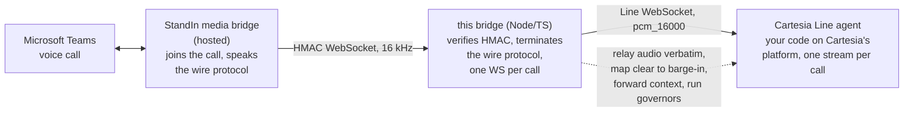
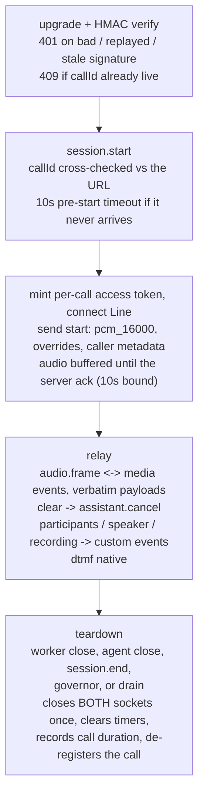

The bridge is a small, stateless-per-call relay. It holds two WebSockets per call - the StandIn media bridge on one side, a Cartesia Line agent stream on the other - and mostly copies strings between them.

## System overview

The StandIn media bridge handles everything about Teams itself and exposes each call as a single WebSocket carrying `audio.frame` (PCM 16 kHz) and control messages. This bridge has no idea what is on the other end of the Teams call - it only speaks the wire protocol. The Line agent's brain is your code on Cartesia's platform - this bridge only speaks the Line WebSocket API.

## The verbatim-payload property

The StandIn wire is base64 **PCM 16 kHz, 16-bit, mono**. The Line stream is pinned to `pcm_16000`, and agent audio returns over the same single-format stream config - so the hot path relays the **base64 string itself**: caller audio is re-wrapped into `media_input` without decoding, agent audio from `media_output` goes onto the wire untouched, and frame timestamps are computed from string length + padding (no decode). This is stronger than the sibling bridges' copy-only property (they at least re-frame base64 to binary).

One caveat, verified defensively rather than by documentation: Cartesia's docs imply but do not state that `media_output` mirrors `config.input_format`. The session logs the first agent frame's byte length and warns when it cannot be 16-bit PCM, so a format surprise is visible in the logs on the first live call.

## Call lifecycle

Ordering contract: the `start` event is the first message on the Line socket, and **no caller audio flows until the server acks** (buffered up to ~5 s, bounded, then flushed oldest-first; a 10 s ack timeout ends the call rather than leaving it silent). The ack also triggers one `call_context` snapshot so the agent code learns the initial participant count and recording state.

Barge-in: Line sends `clear` when playback should be flushed (the caller barged in); the bridge mirrors it to the Teams side with `assistant.cancel`. There is deliberately **no ghost filter** here: `clear` arrives in-band on the same ordered socket, so any `media_output` after it is genuinely new speech - unlike the Deepgram sibling, where the barge-in signal races pipelined TTS frames.

## Source module map

| Module | Responsibility |
|---|---|
| `src/server.ts` | HTTP server + WS upgrade, HMAC validation, connection guards (caps, replay, pre-start, dup-callId 409), session registry, embedder drain, opt-in signal drain |
| `src/session.ts` | One call: the StandIn WS ⇄ Line WS relay, ack gate, context events, governors, goodbye, flush-aware teardown |
| `src/cartesia.ts` | Line socket (token mint, start/ack, media events, keepalive pings), start builder, Sonic TTS for the goodbye |
| `src/protocol.ts` | Wire message types (JSON, camelCase, discriminated on `type`) + PCM duration helper |
| `src/hmac.ts` | `HMAC-SHA256("{timestampMs}.{callId}")` sign/verify (constant-time), header names, freshness |
| `src/config.ts` | Env config, fail-loud numeric parsing, `*.cartesia.ai` allowlist |
| `src/cli.ts` | CLI entry point + friendly startup errors |
| `src/log.ts` / `src/metrics.ts` | Minimal leveled logger; Prometheus counters + call-duration histogram |

## Trust and security model

| Layer | Protection |
|---|---|
| Upgrade auth | `HMAC-SHA256("{timestampMs}.{callId}")`, constant-time compare, fails closed when the secret is unset |
| Replay | Single-use `(callId, ts, sig)` guard within a 60 s freshness window (a zero window fails loud at startup) |
| Duplicate call | A second live connection for the same `callId` is rejected (`409`) - no second billed agent stream |
| DoS | Max connections (64), per-IP cap (default = total cap), 2 MB inbound frame cap, 1 MB outbound backpressure cap (hot-path audio only - control frames and goodbye audio always pass), 10 s pre-start timeout, 90 s dead-peer window |
| Key hygiene | `CARTESIA_API_KEY` is used only over HTTPS to `*.cartesia.ai` (token mint + TTS); each agent socket authenticates with a short-lived, agent-scoped access token |
| Input bounds | Worker frames are validated per type (an `audio.frame` without a payload, a `participants` without a count, a `dtmf` without a digit are dropped, not relayed malformed) |
| Crash safety | Every async entry point is guarded so a single malformed frame from either peer cannot take the process down |
| Shutdown | The CLI's signal drain (or the embedder's `server.drain()`) ends live calls gracefully, letting an in-progress goodbye finish; native TLS pins a 1.2 minimum |
