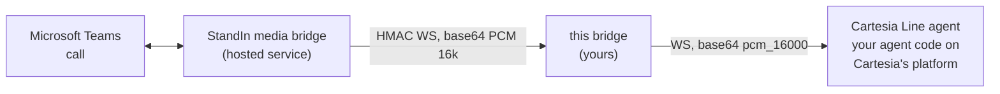

Welcome! **`@komaa/cartesia-msteams-bridge`** (npm: [`@komaa/cartesia-msteams-bridge`](https://www.npmjs.com/package/@komaa/cartesia-msteams-bridge)) puts a [Cartesia Line](https://docs.cartesia.ai/line) voice agent on a real **Microsoft Teams call**.

It is a small Node.js service (and importable TypeScript library) that sits between two WebSockets:

The hosted **StandIn media bridge** ([standin.komaa.com](https://standin.komaa.com)) joins the Teams call and dials into your bridge, one authenticated WebSocket per call. The bridge opens one Line agent stream per call (via Cartesia's [WebSocket API](https://docs.cartesia.ai/line/integrations/websocket-api), the integration Cartesia provides for bringing your own telephony) and relays between them. Both wires carry **base64 PCM 16 kHz mono**, so the hot path relays the payload string **verbatim**: no decode, no re-encode, no resampling, no transcoding.

## Where the brain lives

A Line agent is **your code deployed on Cartesia's platform**: the LLM, the tools, the conversation logic, the hangup decision. That makes this bridge deliberately a **transport** - unlike the sibling bridges there is no in-process tool registry and no vision hook, because the Line wire has no client-side tool channel. Your agent still gets the full Teams context (caller identity, participants, active speaker, DTMF, recording state) through the wire's `metadata` and `custom` events - see [Your Line Agent](/cartesia-msteams-bridge/your-line-agent/).

## What it does

- **Realtime voice** - the caller talks to your Line agent and hears it reply. Turn-taking and interruption are the Line platform's own; the bridge maps Line's `clear` onto a Teams-side playback flush.
- **Per-call personalization** - caller name, tenant and direction ride the start metadata for your agent code; `CARTESIA_INTRODUCTION` gives a deterministic opening line (a natural spoken AI disclosure), `CARTESIA_VOICE_ID` overrides the voice, `CARTESIA_SYSTEM_PROMPT` optionally overrides the prompt (with caller context appended).
- **Native DTMF** - keypad digits are forwarded as Line `dtmf` events, not prompt hacks.
- **Live context events** - participants, active-speaker changes and recording state reach your agent code as `custom` events, with an initial snapshot at stream start.
- **Per-call access tokens** - the long-lived API key never rides an agent socket; each call mints a short-lived, agent-scoped token.
- **Two call governors** - StandIn-side tier cutoffs get a spoken goodbye; a bridge-side `MAX_CALL_MINUTES` hard cap protects your budget. With Sonic TTS configured the goodbye is the exact text, deterministic and backstopped.
- **Hardened transport** - replay-proof HMAC handshake, connection and payload caps, duplicate-call rejection, dead-peer detection, ack-gated audio, and a `*.cartesia.ai` host allowlist so your API key can never be sent elsewhere.

Use the sidebar to navigate. Start with **Getting Started**, then read **Your Line Agent** for what your agent code receives. There is a runnable [example project](https://github.com/komaa-com/cartesia-msteams-bridge/tree/main/examples/basic-bridge) in the repository - walked through in [Run the Example](/cartesia-msteams-bridge/example/).
